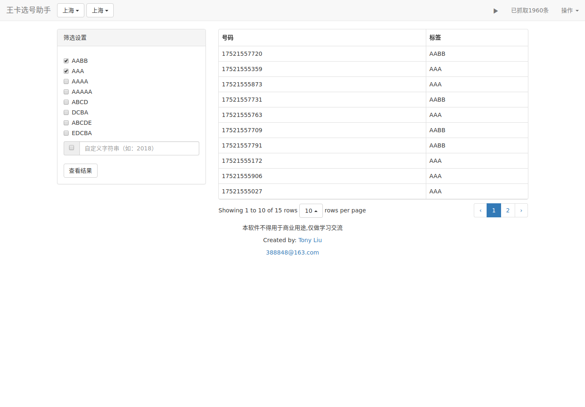

## 王卡选号助手
#### Created By Tony Liu
#### License: GPL

### 特性

1. 支持自定义正则检索

2. 支持腾讯大王卡、星粉卡、天神卡（1元日租版、3元无限量版）的号码抓取，后续会有更多支持

### 截图

### 如何使用

1. 安装最新版本Python 3

2. 安装依赖包：flask, requests

3. 运行main.py文件，在浏览器中打开[http://127.0.0.1:5000/](http://127.0.0.1:5000/)，选择好省市，点击操作->启动爬虫即可

### Tips

1. 爬虫每3秒获取一次号码列表，联通每次会随机返回100号码，与前面获取的结果会有重复，因此增长速度会越来越慢，当100次返回结果中新增条目低于10条时，爬虫自动终止。

2. 爬取的数据保存在SQLite数据库中，用户可以使用DB Browser一类的软件打开numbers.db文件以自定义高级的筛选。
